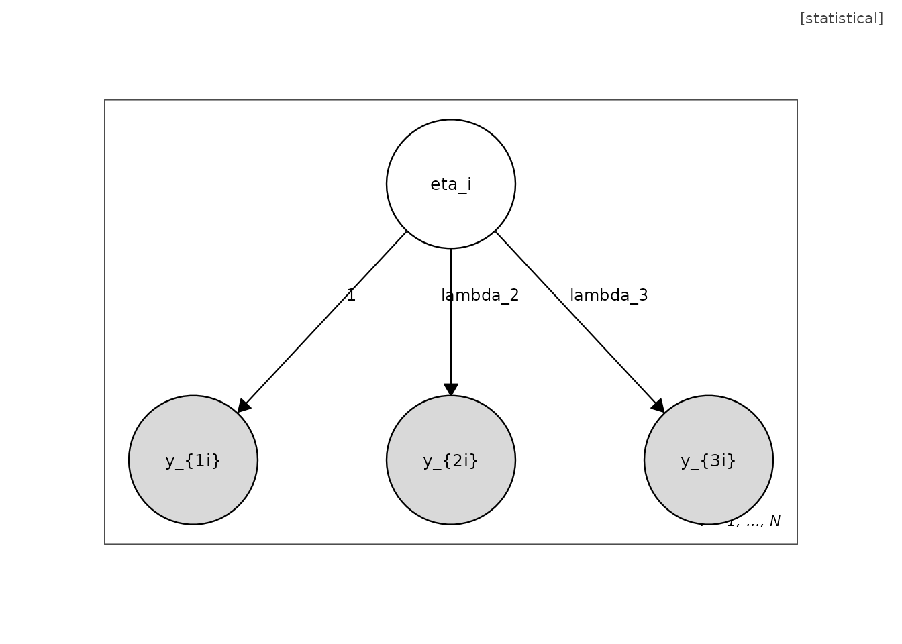
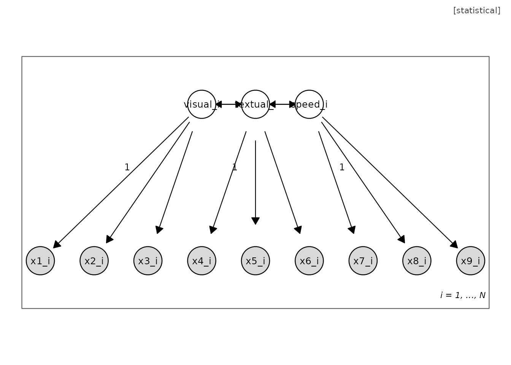
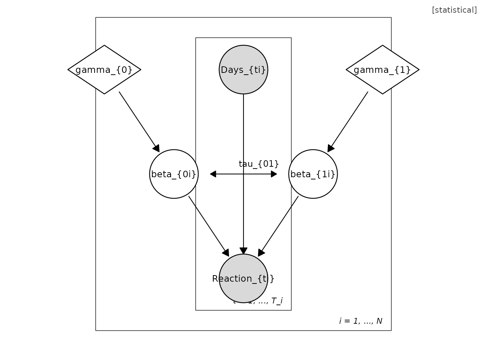
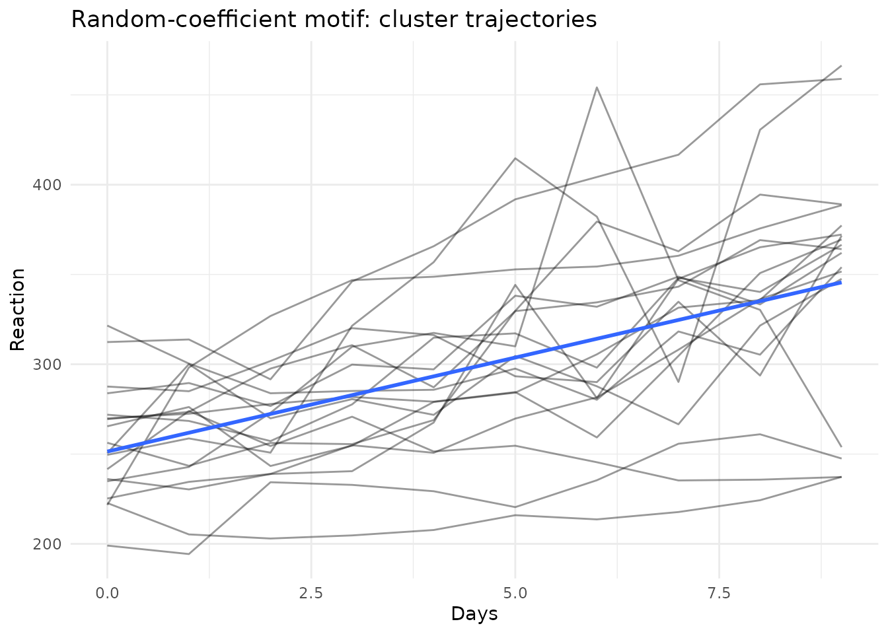

# Unified Model Graphs: An Introduction

## The grammar in one paragraph

A Unified Model Graph (UMG) types every vertex on three dimensions:
observability (fill: shaded = observed), support (shape: circle =
continuous, square = categorical), and inferential role (border and
dedicated shapes: diamond = fixed unknown parameter, triangle = known
constant, double border = deterministic). Edges distinguish stochastic
dependence, symmetric covariance, deterministic assignment, and mixture
selection. Plates encode replication; nesting encodes hierarchy. Every
well-formed diagram corresponds to a likelihood factorization, so the
diagram is the model.

## Building a one-factor model by hand

``` r
m <- umg_model(
  nodes = list(
    umg_node("eta", "$\\eta_i$", observed = FALSE, dist = "N(0, psi)"),
    umg_node("y1", "$y_{1i}$", observed = TRUE),
    umg_node("y2", "$y_{2i}$", observed = TRUE),
    umg_node("y3", "$y_{3i}$", observed = TRUE)
  ),
  edges = list(
    umg_edge("eta", "y1", "dep", fixed = 1),
    umg_edge("eta", "y2", "dep", label = "$\\lambda_2$"),
    umg_edge("eta", "y3", "dep", label = "$\\lambda_3$")
  ),
  plates = list(
    umg_plate("person", c("eta", "y1", "y2", "y3"), "i = 1, ..., N")
  )
)
m
#> Unified Model Graph (statistical badge)
#>   vertices: 4 | edges: 3 | plates: 1 
#>   edge kinds: dep=3
plot(m)
```



## From a lavaan model

``` r
model_syntax <- '
  visual  =~ x1 + x2 + x3
  textual =~ x4 + x5 + x6
  speed   =~ x7 + x8 + x9
'
g <- umg_from_lavaan(model_syntax)
plot(g)
```



## From an lme4 formula

``` r
g2 <- umg_from_lmer(Reaction ~ Days + (Days | Subject))
#> Warning: the 'findbars' function has moved to the reformulas package. Please
#> update your imports, or ask an upstream package maintainer to do so.
#> Warning: the 'nobars' function has moved to the reformulas package. Please
#> update your imports, or ask an upstream package maintainer to do so.
plot(g2)
```



## TikZ export

[`umg_to_tikz()`](https://hsiutingyu.github.io/umg/reference/umg_to_tikz.md)
emits TikZ code in the dialect of the umg-style.tex lexicon shipped in
`inst/tikz/`, so programmatic and hand-drawn diagrams are stylistically
identical.

``` r
cat(head(umg_to_tikz(m), 12), sep = "\n")
#> % Generated by umg::umg_to_tikz()
#> % Requires \input{umg-style} in the preamble.
#> \begin{tikzpicture}
#>   \node[vCL] (eta) at (0,0) {$\eta_i$};
#>   \node[vCO] (y1) at (-1.6,-1.8) {$y_{1i}$};
#>   \node[vCO] (y2) at (0,-1.8) {$y_{2i}$};
#>   \node[vCO] (y3) at (1.6,-1.8) {$y_{3i}$};
#>   \draw[eReg] (eta) -- node[elab]{1} (y1);
#>   \draw[eReg] (eta) -- node[elab]{$\lambda_2$} (y2);
#>   \draw[eReg] (eta) -- node[elab]{$\lambda_3$} (y3);
#>   \begin{scope}[on background layer]
#>     \draw[plate] (-2.15,-2.35) rectangle (2.15,0.55);
```

## Model-data duality

Each UMG motif induces a canonical exploratory display. With the
sleepstudy data, the plate and random-coefficient motifs induce trellis
and spaghetti displays:

``` r
data(sleepstudy, package = "lme4")
plots <- umg_eda_scaffold(g2, sleepstudy, id = "Subject", time = "Days")
names(plots)
#> [1] "scatter_Days_Reaction" "spaghetti"             "facets"
plots$spaghetti
```



## Inspecting a diagram as data

A diagram can be read out as ordinary data frames, which is convenient
for tabulating a model in a manuscript or editing it programmatically
before re-assembly with
[`umg_model()`](https://hsiutingyu.github.io/umg/reference/umg_model.md).

``` r
m_sem <- umg_sem(
  measurement = list(F1 = paste0("y", 1:3), F2 = paste0("y", 4:6)),
  structural  = list(c("F1", "F2"))
)
as.data.frame(m_sem)                    # edges
#>   from to kind            label fixed
#> 1   F1 y1  dep                      1
#> 2   F1 y2  dep $\\lambda_{F12}$    NA
#> 3   F1 y3  dep $\\lambda_{F13}$    NA
#> 4   F2 y4  dep                      1
#> 5   F2 y5  dep $\\lambda_{F22}$    NA
#> 6   F2 y6  dep $\\lambda_{F23}$    NA
#> 7   F1 F2  dep                     NA
as.data.frame(m_sem, what = "vertices") # vertices
#>   name  label observed    support role      dist fill annot
#> 1   F1 $F1_i$    FALSE continuous   rv N(0, psi) <NA>  <NA>
#> 2   F2 $F2_i$    FALSE continuous   rv      <NA> <NA>  <NA>
#> 3   y1 $y1_i$     TRUE continuous   rv      <NA> <NA>  <NA>
#> 4   y2 $y2_i$     TRUE continuous   rv      <NA> <NA>  <NA>
#> 5   y3 $y3_i$     TRUE continuous   rv      <NA> <NA>  <NA>
#> 6   y4 $y4_i$     TRUE continuous   rv      <NA> <NA>  <NA>
#> 7   y5 $y5_i$     TRUE continuous   rv      <NA> <NA>  <NA>
#> 8   y6 $y6_i$     TRUE continuous   rv      <NA> <NA>  <NA>
summary(m_sem)
#> Unified Model Graph summary (statistical badge)
#> -----------------------------------------------
#> Vertices: 8  (observed rv: 6, latent rv: 2, parameters: 0, constants: 0)
#> Categorical-support vertices: 0
#> Edges: dep=7 
#> Plates: 1 (person)
#> Counting rule: 21 data moments, 13 free parameters, df = 8
```

## Round-tripping to lavaan

[`umg_to_lavaan()`](https://hsiutingyu.github.io/umg/reference/umg_to_lavaan.md)
is the inverse of
[`umg_from_lavaan()`](https://hsiutingyu.github.io/umg/reference/umg_from_lavaan.md):
it emits lavaan model syntax from a diagram. A directed edge from a
latent to an observed vertex becomes a measurement loading (`=~`); other
directed edges become regressions (`~`); covariance edges become `~~`.
The correspondence between a diagram and a fitted model is thus
operational in both directions.

``` r
cat(umg_to_lavaan(m_sem))
#> umg_to_lavaan(): latent-to-latent paths written as regressions ('~'); change to '=~' by hand if a higher-order measurement model is intended.
#> # measurement model
#> F1 =~ 1*y1 + y2 + y3
#> F2 =~ 1*y4 + y5 + y6
#> # structural / regression model
#> F2 ~ F1
```

``` r
syntax  <- "visual =~ x1 + x2 + x3\ntextual =~ x4 + x5 + x6"
g       <- umg_from_lavaan(syntax)   # syntax  -> diagram
back    <- umg_to_lavaan(g)          # diagram -> syntax
cat(back)
#> # measurement model
#> visual =~ 1*x1 + x2 + x3
#> textual =~ 1*x4 + x5 + x6
#> # (co)variances
#> visual ~~ textual
```
